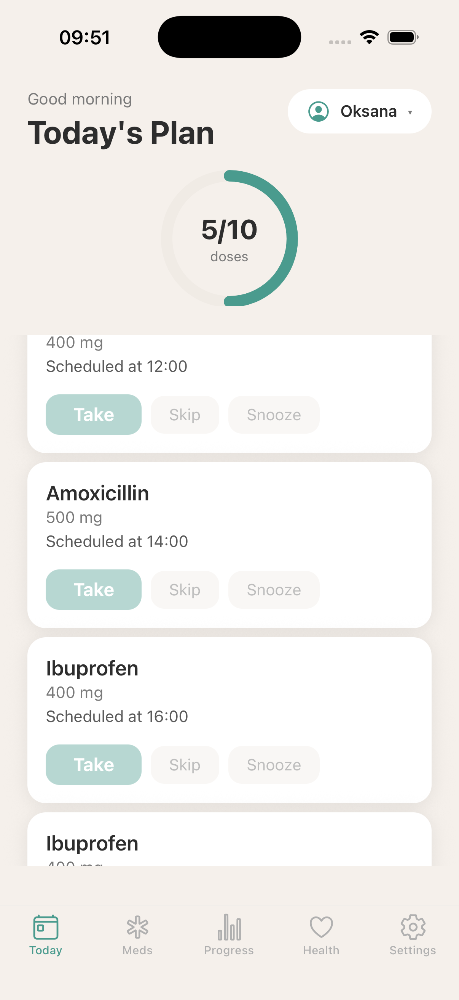
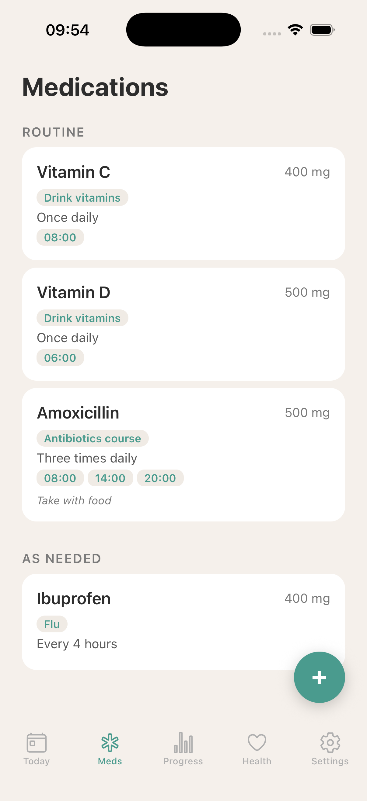
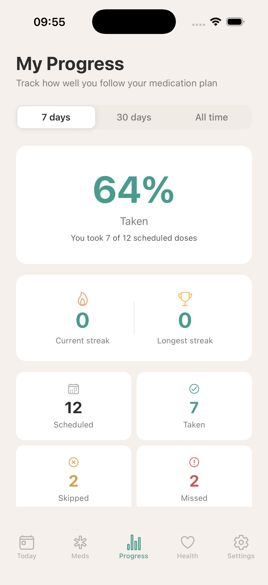
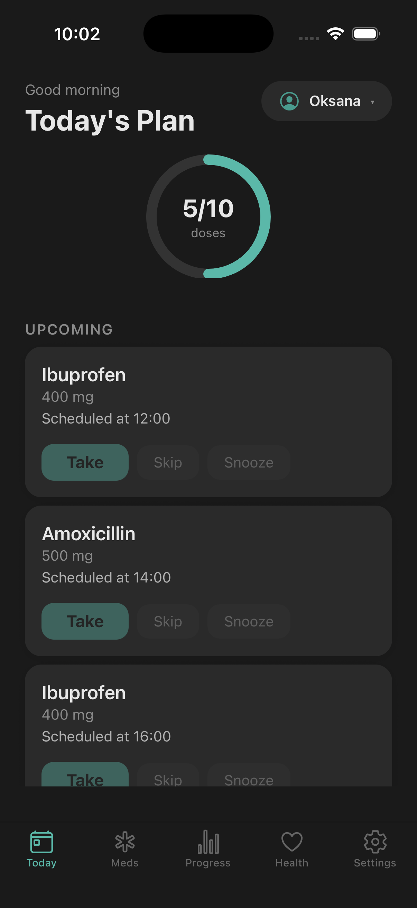
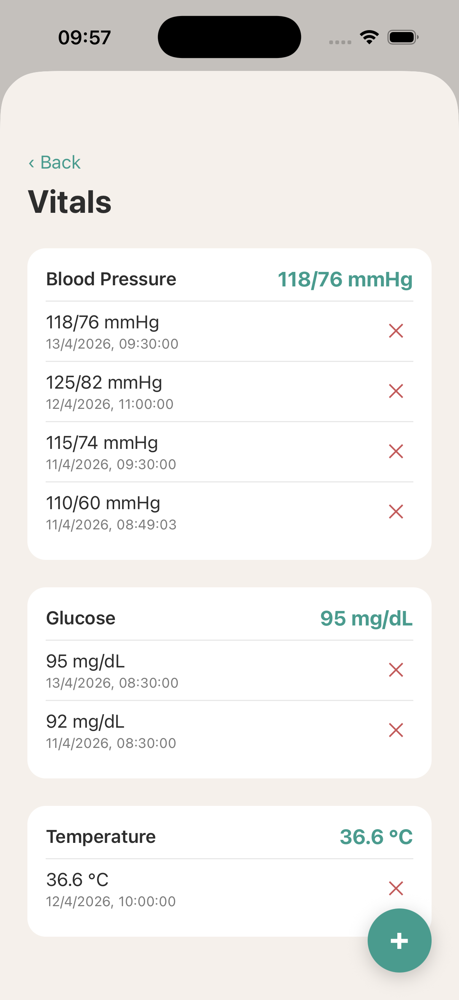
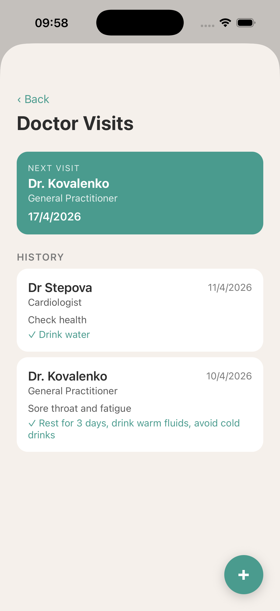
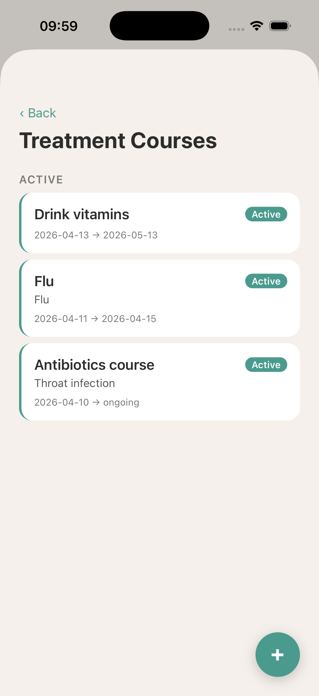
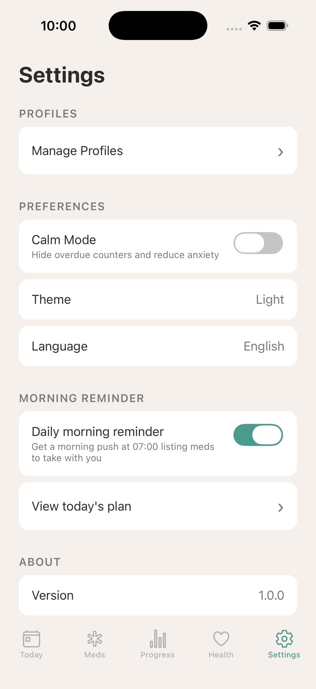

# HealthPal

**Calm. Local. Yours.**

A local-first medication companion built with React Native and Expo. HealthPal helps patients and caregivers manage medications, track adherence, log symptoms, monitor vitals, and prepare for doctor visits — all without requiring an account or internet connection.

## Screenshots

<p align="center">
  
  
  
  
</p>
<p align="center">
  
  
  
  
</p>

## Why HealthPal?

Most medication apps make three mistakes:

1. They create anxiety with red overdue counters and alarming language
2. They force account creation before the user can do anything useful
3. They assume the user is the patient, while in reality it is often a caregiver managing medications for someone else

HealthPal intentionally goes the other way:

| Standard approach | HealthPal |
|---|---|
| Anxiety UX ("8 OVERDUE!") | Calm UX, neutral copy, focus on next action |
| Forced registration | No-account first run |
| Patient-only mental model | Caregiver-first, with Big Button view for patient |
| Cloud-first | Local-first, device DB is source of truth |

## Tech Stack

| Layer | Technology |
|---|---|
| Runtime | Expo SDK 54 + React Native 0.81 + React 19.1 |
| Routing | Expo Router 6 (file-based) |
| Language | TypeScript strict, `noUncheckedIndexedAccess` |
| Local DB | expo-sqlite + Drizzle ORM |
| Fast KV | react-native-mmkv (preferences only) |
| State | Zustand 5 (session state) |
| Forms | React Hook Form + Zod validation |
| Styling | Unistyles 3 (light / dark / calm themes) |
| Charts | @shopify/react-native-skia (adherence calendar, progress ring) |
| Animations | Reanimated 4 (entering, layout transitions, spring) |
| Notifications | @notifee/react-native (scheduled, quick actions, channels) |
| Error reporting | @sentry/react-native with ErrorBoundary |
| Haptics | expo-haptics |
| i18n | i18next (English + Ukrainian) |
| Lint | Biome 2 |
| Hooks | Husky (pre-commit: lint-staged) |

## Architecture

```
apps/mobile/              Expo app (Expo Router, 5 tabs, 15+ screens)
packages/schedule-engine/  Pure TS — computes next dose occurrences
packages/adherence-core/   Pure TS — computes adherence %, streaks, calendar data
```

### Key Principles

1. **SQLite is the source of truth** — 10 tables, domain data lives in SQLite, not in state managers
2. **MMKV is for tiny preferences** — theme, locale, onboarding flag, calm mode, morning reminder settings
3. **Domain logic is extracted** — two pure TypeScript packages with zero RN dependencies and full test coverage
4. **Calm UX** — no aggressive counters, neutral copy, optional Calm Mode hides stress-inducing elements
5. **Caregiver-first** — profile switching, Big Button view for patients, simplified dashboards

### Data Flow

```
UI (Expo Router + Unistyles + Reanimated)
  │ useTodayDoses, useNotifications hooks
  ▼
Domain Layer
  ├─ schedule-engine  (pure TS, 11 tests)
  ├─ adherence-core   (pure TS, 21 tests)
  └─ services (profile, medication, dose-event, symptom, vital, doctor-visit, treatment-course)
  │ Drizzle ORM queries
  ▼
expo-sqlite (10 tables, source of truth)

MMKV (parallel): theme, locale, active profile, calm mode, morning reminder prefs
Notifee: scheduled dose reminders, morning take-with-you, background actions
Sentry: error reporting + global ErrorBoundary
```

## Features

### Today's Plan
- Dynamic greeting (morning / afternoon / evening)
- Skia progress ring showing doses taken
- Upcoming doses with Take / Skip / Snooze actions (haptic feedback)
- Buttons disabled until scheduled time
- Auto-miss: pending doses past 1 hour auto-marked as missed
- Tap completed dose to change status (Taken / Skipped / Missed)

### Medications
- CRUD with Zod validation and inline error messages
- Categories: routine / as needed
- Schedule types: once daily, twice daily, three times daily, every X hours, custom times, as needed
- Time chip picker with iOS spinner and Confirm button
- 8 dosage units (mg, ml, tablet, capsule, drop, puff, patch, injection)
- Treatment course badge on each medication card
- Dose adjustment history with change reason tracking

### My Progress (Adherence)
- Period tabs: 7 days / 30 days / all time
- Animated percentage counter with explanation ("You took 7 of 10 scheduled doses")
- Current streak and longest streak with icons
- Stats grid with icons: scheduled, taken, skipped, missed, snoozed
- GitHub-style Skia heatmap calendar (Mo-Su labels)
- Calm mode hides skipped/missed counters

### Health Hub (5th tab)
- **Symptoms**: log with severity 1-10, notes, recent list
- **Vitals**: blood pressure (with paired pulse), glucose, temperature, weight, heart rate, oxygen saturation
- **Doctor Visits**: pre-visit prep (auto-collects symptoms from last 30 days), recommendations, prescriptions, next visit scheduling
- **Treatment Courses**: group medications by treatment reason (e.g. "Flu", "Antibiotics"), active/completed split, auto-archive medications on course completion
- **Doctor Report**: local A4 PDF via expo-print, shareable without internet

### Notifications
- Scheduled dose reminders via Notifee with Android channels
- Quick actions: Take / Snooze directly from notification
- Background handler for actions when app is closed
- Morning "take with you" reminder: daily push listing meds to pack for the day
- Morning Plan screen with packing checklist

### Profile Health Basics
- Date of birth, weight, height, blood type
- Allergies and chronic conditions (comma-separated lists)
- Per-profile health data accessible via heart icon on profile card

### Profiles & Caregiver Mode
- Multiple profiles: self, caregiver, patient
- Profile switcher in header
- **Big Button view** — simplified patient mode with one large "Take" button
- **Caregiver dashboard** — today's plan, next medication, recent doses
- Edit / delete buttons on profile cards

### Calm Mode
- Hides anxiety-inducing overdue counters
- Removes aggressive warning styling
- Switches to calm theme (muted, warm colors)
- Focus on next action, not guilt

### Skeleton Loading
- Screen-specific skeleton placeholders (Today, Medications, Adherence)
- Shimmer animation via Reanimated
- Replaces generic spinner for professional loading UX

### Accessibility
- Screen reader labels on all interactive elements
- Decorative elements hidden from screen readers
- Large tap targets with hitSlop
- Loading states with skeleton placeholders

### i18n
- English and Ukrainian
- Language toggle in settings
- All UI text externalized — no hardcoded strings

## Database Schema

10 tables: `profiles`, `medications`, `schedules`, `dose_events`, `symptom_logs`, `medication_changes`, `doctor_visits`, `vitals`, `treatment_courses`, `sync_queue`

Indexes on all foreign keys. Additive migrations via `ALTER TABLE ADD COLUMN` with idempotent column existence checks.

## Getting Started

### Prerequisites

- Node.js 20+
- Expo CLI (`npx expo`)
- iOS Simulator (Xcode) or Android Emulator
- Native build required (Skia, Notifee, Reanimated need `expo prebuild`)

### Installation

```bash
git clone https://github.com/Opokhvalenko/health-pal.git
cd health-pal
npm install
cd apps/mobile
npx expo prebuild
npx expo run:ios    # or run:android
```

### Development

```bash
# Start with dev client
cd apps/mobile && npx expo start --dev-client

# Run domain package tests
npm run test:engine
npm run test:adherence

# Lint + format
npm run lint
npm run format

# TypeScript check
npx tsc --noEmit
```

### Project Structure

```
health-pal/
├── apps/
│   └── mobile/
│       ├── app/                    # Expo Router screens
│       │   ├── (tabs)/             # Tab screens (Today, Meds, Progress, Health, Settings)
│       │   ├── onboarding/         # Onboarding flow
│       │   ├── profiles.tsx        # Profile management
│       │   ├── profile-health.tsx  # Health basics form
│       │   ├── medication-form.tsx # Add/edit medication (RHF + Zod)
│       │   ├── medication-history.tsx # Dose adjustment history
│       │   ├── symptoms.tsx        # Symptom logging
│       │   ├── vitals.tsx          # Vitals list
│       │   ├── vital-form.tsx      # Add vital reading
│       │   ├── doctor-visits.tsx   # Doctor visit history
│       │   ├── doctor-visit-form.tsx # Visit prep + record
│       │   ├── treatment-courses.tsx # Course management
│       │   ├── treatment-course-form.tsx
│       │   ├── morning-plan.tsx    # Take-with-you checklist
│       │   └── report.tsx          # PDF doctor report
│       ├── assets/                 # App icon, splash screen
│       ├── screenshots/            # README screenshots
│       └── src/
│           ├── components/         # UI components (Skeleton, ProgressRing, AdherenceCalendar, etc.)
│           ├── config/             # Sentry config
│           ├── db/                 # SQLite schema, 8 services, migrations
│           ├── hooks/              # useTodayDoses, useNotifications
│           ├── i18n/               # en.json, uk.json
│           ├── services/           # Notification service, report generation
│           ├── stores/             # Zustand + MMKV
│           ├── theme/              # Unistyles themes + tokens
│           └── validation/         # Zod schemas
├── packages/
│   ├── schedule-engine/            # Pure TS, 11 tests
│   └── adherence-core/             # Pure TS, 21 tests
└── biome.json                      # Biome config
```

## Testing

- **32 tests** across two domain packages
- `schedule-engine`: once daily, twice daily, every X hours, custom times, paused, end dates, as needed
- `adherence-core`: adherence %, streaks, calendar data, period filters, edge cases (DST, leap years)

```bash
npm run test:packages
```

## Development History

25 pull requests merged across the project lifecycle:

- **R1 Core** (PRs 1-9): Monorepo setup, profiles, medications, dose tracking, adherence, symptoms, doctor report, accessibility, dev build
- **R1 Polish** (PRs 10-16): Skia calendar + progress ring, Notifee notifications, RHF + Zod forms, Reanimated animations, skeleton loading, Sentry, app icon
- **Product Extensions** (PRs 17-22): Profile health basics, dose adjustment history, vitals tracking, doctor visits, treatment courses, morning reminder
- **UI/UX** (PRs 23-25): Health tab, disabled buttons before dose time, Progress redesign, auto-miss, status change

## License

MIT
